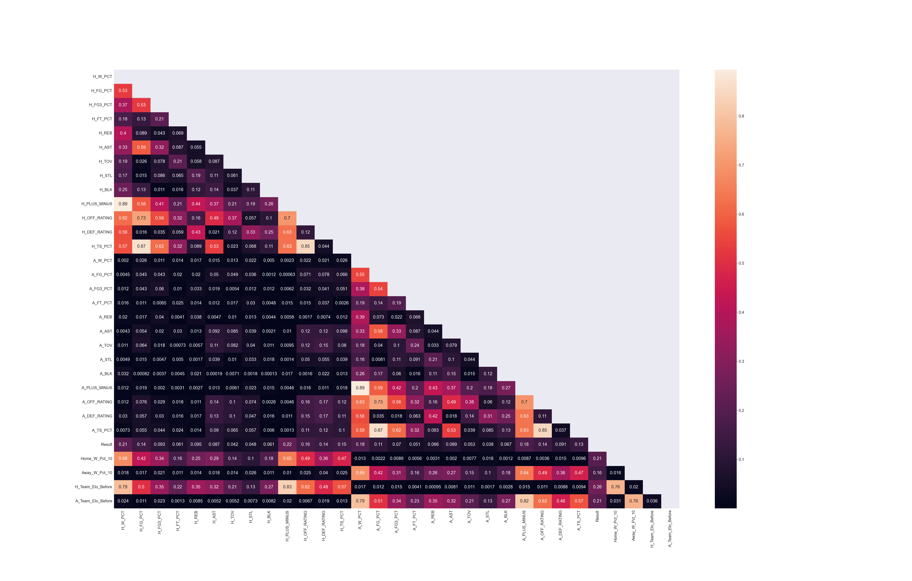
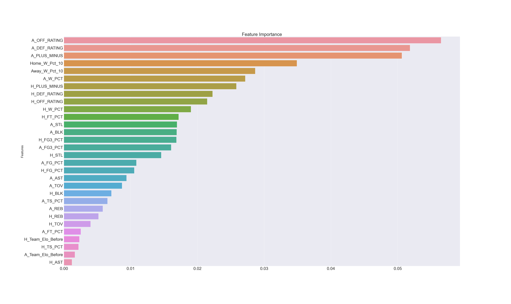
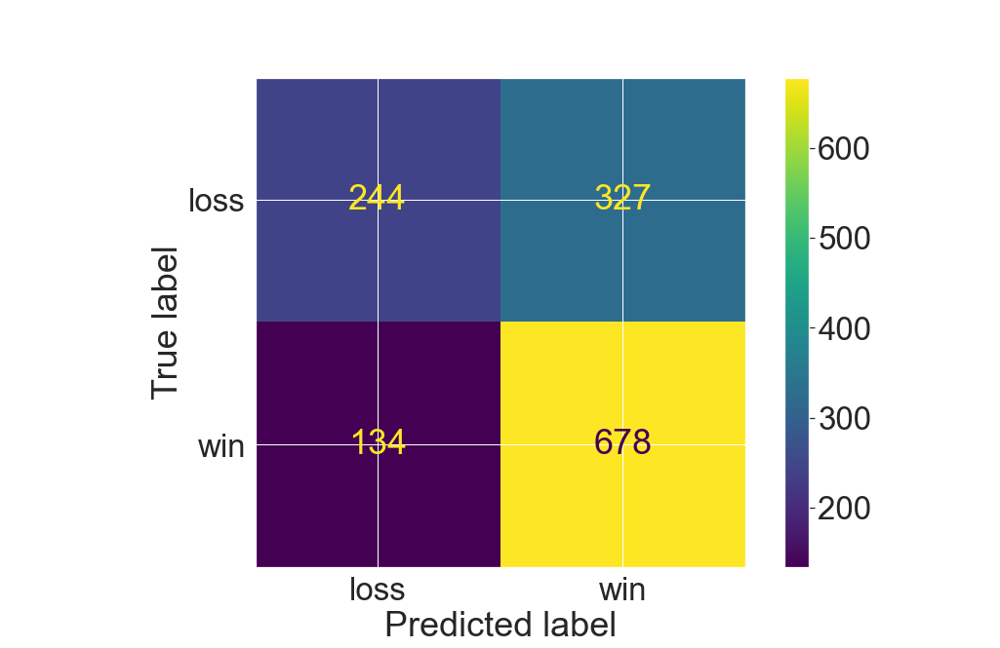

# NBA Game Prediction

## Business Problem
We have been hired by Caesars Sportsbook to answer two questions: 
How accurate can a game prediction model perform?
Can the game predictor be used to make sports betting more accessible? 

## Data
We compiled 6 year regular seasons game data from 2016-17 to 2021-22. Data can be found in `nba.csv` in the data folder in this project's GitHub repository. The descriptions of the column names can be found in the [glossary](https://www.nba.com/stats/help/glossary/). We webscraped game data from [NBA.com](https://www.nba.com/stats/) using the [NBA API](http://nbasense.com/nba-api/).

## Methodology
We used pandas and numpy explore the data. Sklearn to run models and determine accuracy scores. Matplotlib and seaborn were used for visualizations. We engineered features like last 10 games win percentage and Elo rating for both the home and away teams. Next we ran a train-test split on the data to avoid data leakage. Additionally, we standard scaled our train and test, ran numerous models using Logistic Regression, Ridge, Random Forest Classifier, K Nearest Neighbors, Gradient Boosting, Gaussian Naive Bayes, and SVM. We optimized the model parameters using Grid Seearch and Random Grid Search.

## Features
We tested multiple models and combinations and found a few features that effected the prediction of a win or loss for the home team.

First we have Elo rating. 

Another important feature is offensive rating. 

A third important feature was defensive rating. 

Another feature of note was true shooting percentage.

## Model
The best performing modeal was a Logistic Regression. We used Polynomial Features, Standard Scaler, Principal Component Analysis then ran the Logistic Regression. Plug in all the features shown above into our model and we can predict whether the home team wins or loses with 67.39% accuracy. Instead of plugging in the actual game stats, we can plug in the team’s stat averages and ratings based off the prior game or last 10 games. Then our model would output whether the home team is the projected winner or not.

## Conclusions
The NBA has a global audience. Each game draws in 105 million viewers worldwide and in the US most of the views are in CA. Fans like to speculate over the game. Fans place their bets blinded by team allegiance and without any scientific basis, and typically lose on inaccurate predictions.

With our model, forecasting the game results with accuracy is feasible and promises untold economic significance to the sports betting industry. Billions were made off mobile sports gambling last year. Just look at New Jersey. Over 10 billion. And this November California is likely to open those flood gates by passing legislation legalizing sports betting. This is a massive opportunity for Caesars Sportsbook. CA is not only the most populous and prosperous state, it’s also home to the biggest NBA franchises, the Los Angeles Lakers and Golden State Warriors. Don’t you think fans are eager to know who might win tonight’s game? Fans would be more inclined to place a bet if the odds were ever in their favor.

Our predictor satisfies those desires. Caesars Sportsbook could integrate this into your app and launch it in California. Millions of causal fans will have the opportunity to bet on their favorite teams. They don’t have to know odds or point spreads. They simply pick a winner, and that pick has a 67% chance of being accurate. Casual fans may bet on their favorite teams more often knowing the house doesn’t have an unfair advantage. Caesars Sportsbook can grow clientele organically with an accessible sport betting apparatus. And new gamblers may migrate toward other types of betting like point spreads. Our predictor can be the vehicle that drives your clientele and profit growth.

In addition, Caesars Sportsbook can incorporate our model in its odds setting process. You’d be able to pick winners with 67% accuracy which is far better than professional gamblers and pay out winnings less often because your picks would be more accurate. As states legalize sports betting, the stakes are only getting higher. So why don’t you bet on the ID10T and Let’s Ride Consulting Group? With us, the odds will be ever in your favor.  
