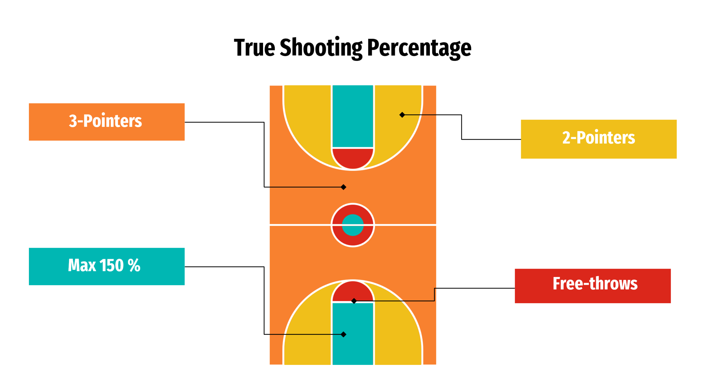
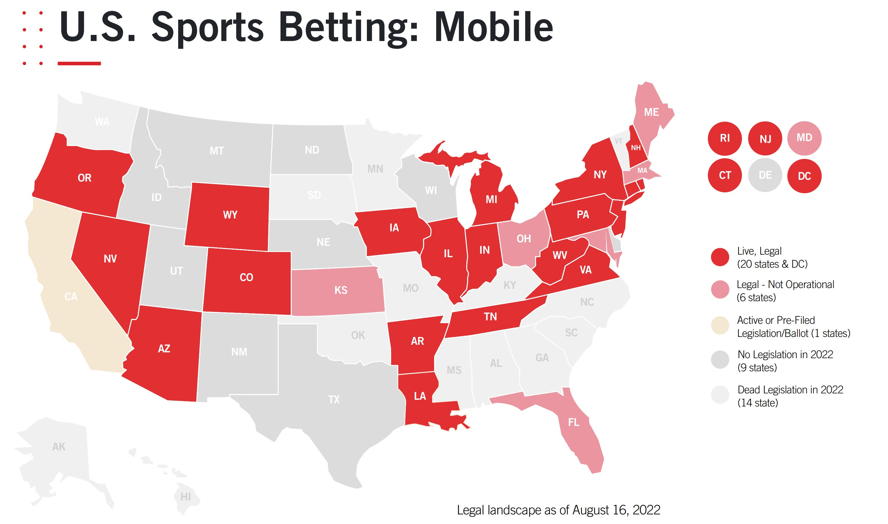

# NBA Game Prediction

## Business Problem
We have been hired by Caesars Sportsbook to answer two questions: 
How accurate can a game prediction model perform? 
Can the game predictor be used to make sports betting more accessible? 

## Data
We compiled 6 years of regular seasons game data from 2016-17 to 2021-22. Data can be found in `nba.csv` in the data folder in this project's [GitHub repository](https://github.com/alvaromendizabal/NBA_Prediction_Model). The descriptions of the column names can be found in the [glossary](https://www.nba.com/stats/help/glossary/) and in the Features section of the [README](https://github.com/alvaromendizabal/NBA_Prediction_Model/blob/main/README.md). supplemental explanations We webscraped game data from [NBA.com](https://www.nba.com/stats/) using the [NBA API](http://nbasense.com/nba-api/).

## Methodology
We used pandas and numpy explore the data. Sklearn to run models and determine accuracy scores. Matplotlib and seaborn were used for visualizations. We engineered features like last 10 games win percentage and Elo rating for both the home and away teams. Next we ran a train-test split on the data to avoid data leakage. Additionally, we standard scaled our train and test, ran numerous models using Logistic Regression, Ridge, Random Forest Classifier, K Nearest Neighbors, Gradient Boosting, Gaussian Naive Bayes, and SVM. We optimized the model parameters using Grid Search and Random Grid Search.

## Features
We tested multiple models and combinations and found a few features that effected the prediction of a win or loss for the home team.

First we have Elo rating. For those new to Elo, here are its essential features: 
 
Ratings are tied to game-by-game rather than a season-by-season performance. So we can see changes in a team’s “form” over the course of the season. 
 
Elo ratings depend on the final score of a game and where it was played (home-court advantage). Elo includes both regular-season and playoff games. 
 
Teams gain Elo points after winning and lose points after losing. A team gains more points for an upset win and for winning by wide margins. 
 
Elo system is zero-sum. When the Golden State Warriors were on their historic run during the 2015-16 season they had a record of 73-9 and the 2nd highest Elo rating in NBA history at 1839. During those NBA Finals the Warriors started with a 3-1 series lead against the Cleveland Cavaliers. In the end, the Cavaliers pulled off a huge upset and actually won the championship, the Warriors never passed the 1995-96 Chicago Bulls 1853 Elo peak, and their Elo had dropped to 1756. 
 
The long-term average Elo rating is 1500, although it may vary in any particular year depending on how recently the league has expanded. Over 90% of team ratings are between 1300 (awful) and 1700 (great), but historically terrible or great teams may fall outside that range.

Another important feature is defensive rating. Basketball stresses efficiency. Minimizing points allowed and maximizing points scored on each possession is more important than overall totals. Totals are shaped by variables like pace — or the number of possessions a team gets in a game — which differs depending on coaching (i.e. the Golden State Warriors averaged 3 fewer possessions per game than the Los Angeles Lakers during the 2021-22 season). 

This is where tempo-free stats offensive and defensive rating come into play. Defensive rating shows how many points a player allows per 100 possessions. This statistic functions differently than a plus/minus system, where all points scored while a player is on the court count against them. Only the shots that are scored as a result of their defensive lapses are counted against them.

A third important feature was offensive rating. Offensive rating is simpler to calculate. It's just the amount of points produced by a player per 100 possessions. Again, the reason offensive and defensive ratings are useful is because they're tempo-free stats. Offensive and defensive rating eliminate factors like pace of play and minutes played per game.

Another feature of note was true shooting percentage. There are 3 ways that an NBA player can score: 3-pointers, 2-pointers and free throws. True shooting percentage ('TS_PCT') looks at all three. 3-pointers are a little tricky to factor into the equation. The max true shooting percentage  is 150% and can only be reached if a player hits every one of their shots and they're all from behind the arch. Because this stat accounts for all shots, it's easily the best measure of shooting ability. 

For example, if a player goes 1-for-1 and their only shot is from the hash-mark, the formula will read and simplify as follows (please just trust and accept that the .44 multiplier is the best way of estimating the total number of possessions a player is involved in)
$$\frac{points} {2 *fga + .44 * fta}$$
$$\frac{3}  {2 * 1 + .44 * 0} = \frac{3}{2} = {1.5}$$

## Model
The best performing modeal was a Logistic Regression. We used Polynomial Features, Standard Scaler, Principal Component Analysis then ran the Logistic Regression. Plug in all the features shown above into our model and we can predict whether the home team wins or loses with 67.39% accuracy. Instead of plugging in the actual game stats, we can plug in the team’s stat averages and ratings based off the prior game or last 10 games. Then our model would output whether the home team is the projected winner or not.

## Conclusions
The NBA has a global audience. Each game draws in 105 million viewers worldwide and in the US most of the views are in CA. Fans like to speculate over games. Fans place their bets blinded by team allegiance and without any scientific basis, and typically lose on inaccurate predictions.

With our model, forecasting the game results with accuracy is feasible and promises untold economic significance to the sports betting industry. Billions were made off mobile sports gambling last year. Just look at New Jersey. Over 10 billion. And this November California is likely to open those flood gates by passing legislation legalizing sports betting. This is a massive opportunity for Caesars Sportsbook. CA is not only the most populous and prosperous state, it’s also home to the biggest NBA franchises, the Los Angeles Lakers and Golden State Warriors. Don’t you think fans are eager to know who might win tonight’s game? Fans would be more inclined to place a bet if the odds were ever in their favor.

Our predictor satisfies those desires. Caesars Sportsbook could integrate this into its app and launch it in California. Millions of causal fans will have the opportunity to bet on their favorite teams. They don’t have to know odds or point spreads. They simply pick a winner, and that pick has a 67% chance of being accurate. Casual fans may bet on their favorite teams more often knowing the house doesn’t have an unfair advantage. Caesars Sportsbook can grow clientele organically with an accessible sport betting apparatus. And new gamblers may migrate toward other types of betting like point spreads. Our predictor can be the vehicle that drives your clientele and profit growth.

In addition, Caesars Sportsbook can incorporate our model in its odds setting process. You’d be able to pick winners with 67% accuracy which is far better than professional gamblers and pay out winnings less often because your picks would be more accurate. As states legalize sports betting, the stakes are only getting higher. So why don’t you bet on the ID10T and Let’s Ride Consulting Group? With us, the odds will be ever in your favor.  
